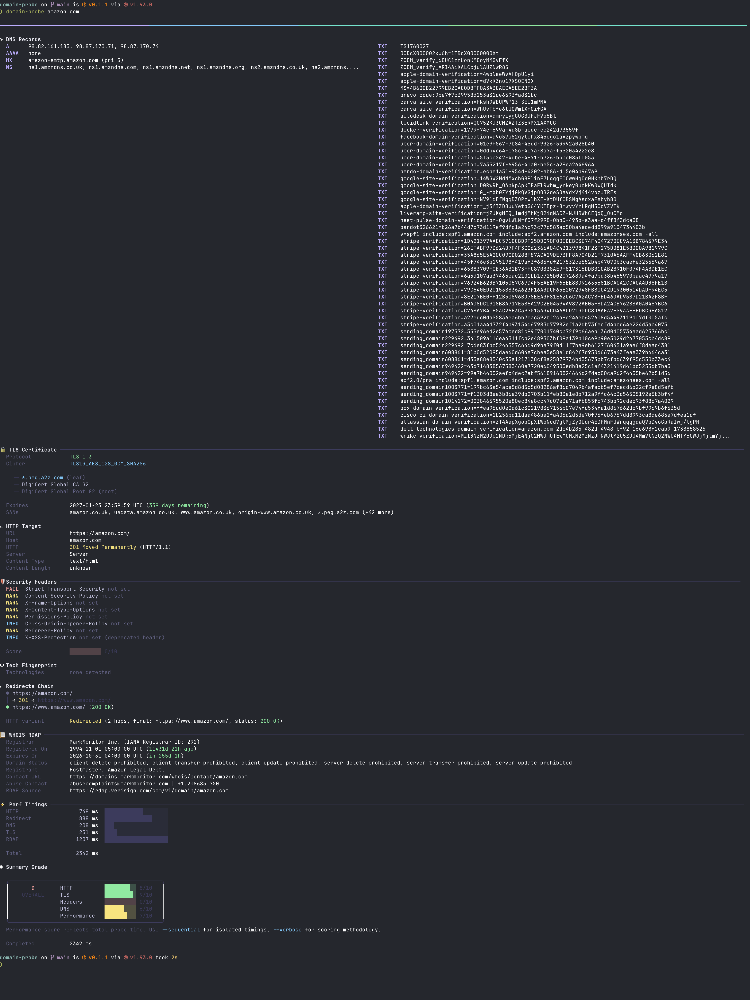

<p align="center">
  <picture>
    <source media="(prefers-color-scheme: dark)" srcset="assets/logo-dark.svg">
    <source media="(prefers-color-scheme: light)" srcset="assets/logo-light.svg">
    
  </picture>
</p>

<p align="center">
  Fast, thorough domain intelligence from the terminal.
</p>

<p align="center">
  <a href="#install">Install</a> &middot;
  <a href="#usage">Usage</a> &middot;
  <a href="#output-modes">Output Modes</a> &middot;
  <a href="#sections">Sections</a> &middot;
  <a href="#configuration">Configuration</a> &middot;
  <a href="#license">License</a>
</p>

---

**domain-probe** runs parallel probes against a URL or hostname and returns a structured report covering DNS records, TLS certificates, HTTP metadata, security headers, redirect chains, RDAP/WHOIS registration, technology fingerprinting, performance timings, and an overall health grade — all in one command.

<p align="center">
  
</p>

## Install

### Homebrew (macOS / Linux)

```bash
brew install dardevelin/tap/domain-probe
```

### Pre-built binaries

Download the latest tarball from [GitHub Releases](https://github.com/dardevelin/domain-probe/releases) and extract it:

```bash
# macOS (Apple Silicon)
tar xzf domain-probe-0.1.2-aarch64-apple-darwin.tar.gz
sudo mv domain-probe /usr/local/bin/

# Linux x86_64
tar xzf domain-probe-0.1.2-x86_64-unknown-linux-gnu.tar.gz
sudo mv domain-probe /usr/local/bin/

# Linux ARM64
tar xzf domain-probe-0.1.2-aarch64-unknown-linux-gnu.tar.gz
sudo mv domain-probe /usr/local/bin/
```

### Debian / Ubuntu

```bash
curl -LO https://github.com/dardevelin/domain-probe/releases/download/v0.1.2/domain-probe_0.1.2_amd64.deb
sudo dpkg -i domain-probe_0.1.2_amd64.deb
```

### Arch Linux

```bash
curl -LO https://github.com/dardevelin/domain-probe/releases/download/v0.1.2/domain-probe-0.1.2-1-x86_64.pkg.tar.zst
sudo pacman -U domain-probe-0.1.2-1-x86_64.pkg.tar.zst
```

### From source

Requires [Rust](https://rustup.rs/) (edition 2024).

```bash
cargo install --path . --locked
```

Or build without installing:

```bash
cargo build --release
./target/release/domain-probe stripe.com
```

## Usage

```bash
# Probe a domain (https:// assumed if no scheme given)
domain-probe stripe.com

# Probe a specific URL
domain-probe https://models.dev/api.json

# Sequential mode — probes run one at a time with isolated timings
domain-probe --sequential stripe.com

# Verbose — show methodology notes and per-probe timing annotations
domain-probe -v stripe.com
```

## Output Modes

| Flag | Description |
|------|-------------|
| *(default)* | Streaming report — probes run in parallel, sections render as they complete |
| `--sequential` | Sequential report — probes run one at a time for isolated perf timings |
| `--quick` `-q` | Compact single-line summary |
| `--json` `-j` | Machine-readable JSON (no banner, no color) |

```bash
# Compact overview
domain-probe -q cloudflare.com

# Pipe JSON to jq
domain-probe -j stripe.com | jq '.tls.protocol_version'
```

## Sections

The report is divided into sections. By default all sections are shown; use `--section` / `-s` to pick specific ones:

```bash
domain-probe -s dns,tls,summary cloudflare.com
```

| Section | Aliases | What it covers |
|---------|---------|----------------|
| `dns` | `ip` | A, AAAA, MX, NS, TXT, CAA records via system resolver + Cloudflare DoH fallback |
| `tls` | `cert`, `certificate` | Protocol version, cipher suite, certificate chain, expiry, SANs |
| `target` | `http` | HTTP status, version, server, content-type, content-length |
| `headers` | `security`, `security-headers` | HSTS, CSP, X-Frame-Options, X-Content-Type-Options, Permissions-Policy, COOP, Referrer-Policy, X-XSS-Protection |
| `redirects` | `redirect` | Full redirect chain with status codes + alternate scheme (http/https) variant |
| `tech` | `technology`, `fingerprint` | Technology detection from HTTP response headers |
| `whois` | `rdap` | Registrar, registration/expiry dates, domain status, abuse contacts via RDAP |
| `performance` | `perf` | Wall-clock timing per probe with bar chart |
| `summary` | `grade` | Composite health grade (A+ through F) with per-category scores |

### Grading

The summary grade is a weighted composite:

| Category | Weight | Factors |
|----------|--------|---------|
| TLS | 25% | Protocol version, cipher suite, certificate validity |
| HTTP | 25% | Status code, HTTP version, redirect health, domain registration |
| Headers | 20% | Security header presence and correctness |
| DNS | 15% | Record coverage (A, AAAA, MX, NS, TXT, CAA) |
| Performance | 15% | Total probe wall-clock time |

Thresholds: **A+** >= 95 | **A** >= 85 | **B** >= 75 | **C** >= 65 | **D** >= 50 | **F** < 50

## Options

```
domain-probe [OPTIONS] <TARGET>
```

| Option | Description | Default |
|--------|-------------|---------|
| `<TARGET>` | URL or hostname to probe | *required* |
| `-s`, `--section <LIST>` | Comma-separated sections to show | all |
| `-q`, `--quick` | Compact single-line output | off |
| `-j`, `--json` | JSON output | off |
| `-v`, `--verbose` | Show methodology details and per-probe timings | off |
| `--sequential` | Run probes one at a time | off |
| `--no-color` | Disable colored output | off |
| `--timeout <SECS>` | Request timeout in seconds | 10 |

## Configuration

Optional config file at `~/.config/domain-probe/config.toml`:

```toml
[network]
timeout = 10              # request timeout in seconds
max_redirect_hops = 10    # max redirect chain depth
user_agent = "domain-probe/0.1"

[dns]
doh_url = "https://dns.google/resolve"   # DNS-over-HTTPS fallback

[animation]
enabled = true   # set to false to disable the animated logo

[colors]
# Override any color in the palette (hex)
green  = "#86EFAC"
cyan   = "#7DD3FC"
yellow = "#FDE68A"
red    = "#FCA5A5"
purple = "#C4B5FD"
orange = "#FDBA74"
teal   = "#5EEAD4"
fg     = "#C8C8E0"
muted  = "#6B6B8D"
dim    = "#444466"
bright = "#EEEEF5"
```

## Pipe Safety

When stdout is not a TTY (e.g. piped to `cat`, `grep`, or a file), domain-probe automatically:

- Disables colors and ANSI escapes
- Skips the animated logo
- Uses plain ASCII fallback for the banner
- Hides spinners

This means `domain-probe stripe.com | cat` produces clean, parseable text output.

For fully machine-friendly output, use `--json` (`-j`) which emits structured JSON with no banner, no color, and no decorations — ideal for scripting and CI pipelines:

```bash
domain-probe -j stripe.com | jq '.summary.grade'
```

## Building Linux Binaries with Docker

Linux release binaries are built inside Docker containers using `Dockerfile.test`. This multi-stage Dockerfile defines base images for Arch Linux, Debian, and Ubuntu — each installs Rust via rustup, copies the source tree, and runs `cargo build --release` followed by a smoke test (`--help` and a live probe).

```bash
# Build for a specific distro and platform
docker build --build-arg DISTRO=debian --platform linux/amd64 \
  -t domain-probe-test:debian-amd64 -f Dockerfile.test .

docker build --build-arg DISTRO=archlinux --platform linux/amd64 \
  -t domain-probe-test:archlinux-amd64 -f Dockerfile.test .
```

To extract the compiled binary from a container:

```bash
docker create --name dp-extract domain-probe-test:debian-amd64 true
docker cp dp-extract:/src/target/release/domain-probe ./domain-probe
docker rm dp-extract
```

The binaries use rustls (no OpenSSL dependency), so a single binary per architecture works across all Linux distros. On an Apple Silicon Mac, Docker Desktop's QEMU emulation handles `--platform linux/amd64` builds transparently — no cross-compilation toolchain needed.

## Packaging

Distribution packaging metadata lives on dedicated orphan branches, separate from the source code on `main`:

| Branch | Contents |
|--------|----------|
| [`packaging/homebrew`](https://github.com/dardevelin/domain-probe/tree/packaging/homebrew) | Homebrew formula (`Formula/domain-probe.rb`) |
| [`packaging/debian`](https://github.com/dardevelin/domain-probe/tree/packaging/debian) | Debian control file and build script |
| [`packaging/arch`](https://github.com/dardevelin/domain-probe/tree/packaging/arch) | Arch Linux PKGBUILD |

These are **orphan branches** — they have no shared commit history with `main`. This is intentional:

- **Clean separation** — packaging metadata is distro-specific and evolves on its own cadence, independent of the source code. Keeping it off `main` avoids cluttering the source tree with files most contributors will never touch.
- **Independent versioning** — a formula or PKGBUILD can be updated (e.g. to fix a checksum or add a dependency) without creating noise in the source history.
- **Standard practice** — Homebrew taps, Debian packaging, and AUR PKGBUILDs are conventionally maintained in their own repositories or branches. Orphan branches give the same isolation within a single repo.

Release binaries and tarballs are published to [GitHub Releases](https://github.com/dardevelin/domain-probe/releases) — they are never committed to any branch.

## License

[MIT](LICENSE)
